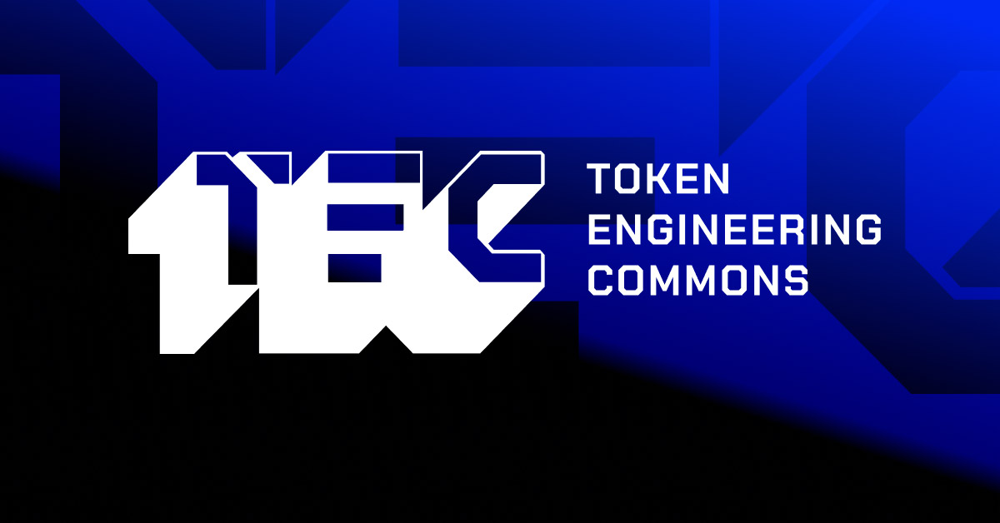

# Overview

This website lives at https://tecommons.org.

It is hosted on Netlify and integrates with Netlify CMS for easy content updates.

## Edit content

Prerequisite: You need writte access to this repository.

### Option 1, Netlify CMS

Access the CMS here: https://tecommons.org/admin (not working yet)

### option 2, Edit markdown directly

All markdown files are located in the [content](./content) folder. Edit and make a pull request.

## Build

Clone this repository and install the dependencies:

```sh
npm install
```

Run local dev server:

```sh
npm run dev
```
